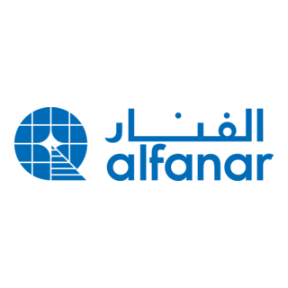

<!--
███████████████████████████████████████████████████████████████████
          OSAMA SHAKAKI — AI Engineer · Multi-Agent Architect
███████████████████████████████████████████████████████████████████
-->

<div align="center">

```
┌─────────────────────────────────────────────────────────────────┐
│                                                                   │
│          ██████╗ ███████╗ █████╗ ███╗   ███╗ █████╗             │
│         ██╔═══██╗██╔════╝██╔══██╗████╗ ████║██╔══██╗            │
│         ██║   ██║███████╗███████║██╔████╔██║███████║            │
│         ██║   ██║╚════██║██╔══██║██║╚██╔╝██║██╔══██║            │
│         ╚██████╔╝███████║██║  ██║██║ ╚═╝ ██║██║  ██║            │
│          ╚═════╝ ╚══════╝╚═╝  ╚═╝╚═╝     ╚═╝╚═╝  ╚═╝            │
│                                                                   │
│      ███████╗██╗  ██╗ █████╗ ██╗  ██╗ █████╗ ██╗  ██╗██╗        │
│      ██╔════╝██║  ██║██╔══██╗██║ ██╔╝██╔══██╗██║ ██╔╝██║        │
│      ███████╗███████║███████║█████╔╝ ███████║█████╔╝ ██║        │
│      ╚════██║██╔══██║██╔══██║██╔═██╗ ██╔══██║██╔═██╗ ██║        │
│      ███████║██║  ██║██║  ██║██║  ██╗██║  ██║██║  ██╗██║        │
│      ╚══════╝╚═╝  ╚═╝╚═╝  ╚═╝╚═╝  ╚═╝╚═╝  ╚═╝╚═╝  ╚═╝╚═╝        │
│                                                                   │
│         AI Engineer  ·  Multi-Agent Architect  ·  NLP            │
│                     📍 Riyadh, Saudi Arabia                       │
└─────────────────────────────────────────────────────────────────┘
```

</div>

<div align="center">

[](https://git.io/typing-svg)

</div>

<div align="center">

<!-- Social Badges -->
[](www.linkedin.com/in/osama-shakaki-680a59229)
[](mailto:osamash040@gmail.com)
[](https://github.com/OsamaShakaki)
[](tel:+966536191604)

</div>

<br>

<div align="center">

## 👋 Hi, I'm Osama Shakaki

**AI Engineer · Multi-Agent Architect · NLP Specialist** 

</div>

I build **intelligent systems that think** — from multi-agent research platforms and RAG pipelines, to bio-signal AI that translates EEG brain waves into Arabic text. I graduated with **class honors in Computer Science** from Islamic University, and I've turned that foundation into real products: two hackathon wins, a KAUST AI certification, and systems deployed under competitive pressure.

My work lives at the intersection of **LLMs, autonomous agents, and applied NLP** — I'm not interested in demos. I'm interested in AI that actually ships.

<div align="center">


| x2 | 94% | 5+ | KAUST |
|:---:|:---:|:---:|:---:|
| Hackathon champion | EEG classification accuracy | AI projects shipped | Stage 3 — AI program |

---
</div>


</div>

## 🏆 Achievements

<div align="center">

| 🥇 Agenticthon 2026 | 🥇 Future Fintech Hackathon | 🎓 KAUST AI Program |
|:---:|:---:|:---:|
| **1st Place** — Monjez Multi-Agent Platform | **1st Place** — AI Loan Recommendation | **Stage 3** Completion |
| Multi-agent research automation with LLMs + RAG | Built in 48 hours · Data-driven fintech | Advanced AI & ML track |

</div>

---

## 🚀 Featured Projects

<details>
<summary><b>🧬 AI EEG Signal Converter — Graduation Project &nbsp;</b><code>🧠 94% Accuracy</code> &nbsp;[ expand ]</summary>

<br>

> *Translating brain electrical signals into Arabic text using deep learning*

**Stack:** `Python` · `Deep Learning` · `Signal Processing` · `Feature Engineering` · `scikit-learn`  
**Highlight:** Custom Arabic letter dataset · Real-time inference pipeline · Published accuracy: **94%**

</details>

---

<details>
<summary><b>🤖 Monjez — Multi-Agent AI Platform &nbsp;</b><code>🥇 Agenticthon 2026</code> &nbsp;[ expand ]</summary>

<br>

> *Automating scientific research paper ingestion, analysis, and structured synthesis*

```
 PDF INPUT
    │
    ▼
┌──────────┐    ┌──────────────┐    ┌──────────────┐    ┌──────────────┐
│  Agent 1 │───▶│   Agent 2    │───▶│   Agent 3    │───▶│   Agent 4   │
│  Parser  │    │  RAG Engine  │    │  Synthesizer │    │  Formatter  │
│          │    │              │    │              │    │             │
│ Chunking │    │  Embedding   │    │  LLM Fusion  │    │  Structured │
│ Cleaning │    │  Retrieval   │    │  Reasoning   │    │  Output     │
└──────────┘    └──────────────┘    └──────────────┘    └──────────────┘
                       │
               ┌───────┴───────┐
               │  LLM Backbone │
               │  + VectorDB   │
               └───────────────┘
```

**Stack:** `Python` · `LangChain` · `LangGraph` · `LLMs` · `ChromaDB` · `RAG` · `Multi-Agent`  
**Role:** System Architect & Lead Developer

</details>

---

<details>
<summary><b>💰 AI Loan Recommendation Platform &nbsp;</b><code>🥇 Future Fintech</code> &nbsp;[ expand ]</summary>

<br>

> *Intelligent financial advisor matching users to optimal loan products*

**Stack:** `Python` · `Data Science` · `ML Recommendation Engine` · `Feature Engineering`  
**Built in:** 48 hours during live hackathon · Production-ready pipeline

</details>

---

<details>
<summary><b>👁️ Smart Vision System — SCAI AI League &nbsp;</b>[ expand ]</summary>

<br>

> *Real-time AI assistant for visually impaired users + automated sports commentary*

**Stack:** `Computer Vision` · `Python` · `Real-Time Processing` · `Audio Synthesis`

</details>

---

<details>
<summary><b>✈️ Airline Reservation System — Software Engineering &nbsp;</b>[ expand ]</summary>

<br>

> *Multi-airline booking platform with dynamic scheduling and seat management*

**Stack:** `Java` · `Relational Database Design` · `Full-Stack Development`

</details>

---

## 🛠️ Tech Stack

<div align="center">


### 🧠 &nbsp; AI Orchestration & Agents


### 🤖 &nbsp; LLM APIs & Inference


### 🗄️ &nbsp; Vector Databases & RAG


### 🔬 &nbsp; ML / DL Frameworks


### 📊 &nbsp; Data & Analytics


---
</div>

## 📜 Certifications

<div align="center">

| Certificate | Issuer | Focus |
|:-----------:|:------:|:-----:|
| 🎓 KAUST AI Program — Stage 3 | KAUST | Advanced AI & Machine Learning |
| 🤖 RAG & Agentic AI | IBM | Retrieval-Augmented Generation |
| 🛠️ Technical Support | Google | IT Infrastructure |
| 📈 Forward Program | McKinsey | Business & Leadership |

</div>

---

## 📊 Stats


<div align="center">


</div>

---

## 💼 Experience

<table>
  <tr>
    <td valign="top" width="130" align="center">
      <br/>
          
    </td>
    <td valign="top" style="padding-left: 12px;">
      <h3>🖥️ IT Support Intern &nbsp;·&nbsp; <a href="https://www.alfanar.com">Alfanar Company</a></h3>
      <p>
        📍 Riyadh, Saudi Arabia &nbsp;·&nbsp; 🗓️ 2025 &nbsp;·&nbsp; 
        
      </p>
      <ul>
        <li>Resolved hardware and software issues across enterprise IT infrastructure</li>
        <li>Monitored network performance alongside senior admins</li>
        <li>Documented recurring issues and improved internal knowledge base</li>
      </ul>
    </td>
  </tr>
</table>

---
<div align="center">

<div align="center">

<!-- Footer Wave -->


*"Intelligence is not just about thinking — it's about building systems that think."*  
**Osama Shakaki**

</div>

**Open to collaborations · Research projects · Agentic AI opportunities**

[](https://www.linkedin.com/in/osama-shakaki-680a59229)
[](mailto:osamash040@gmail.com)

</div>

---

<div align="center">
<sub>Built with precision · No generators · Just craft &nbsp;⚡</sub>
</div>
